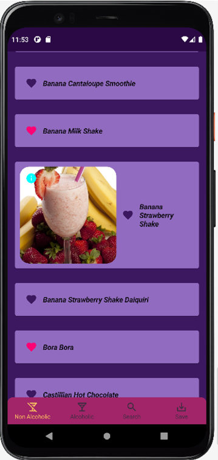
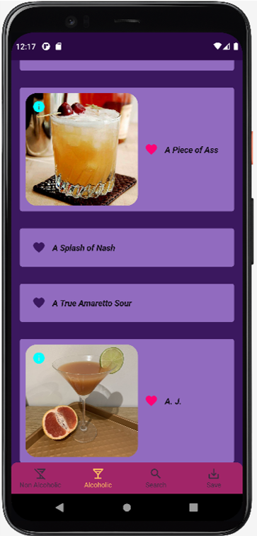
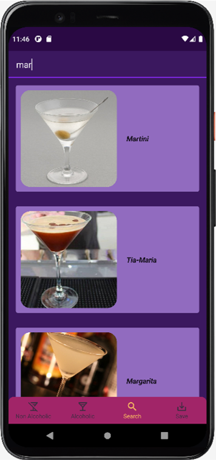
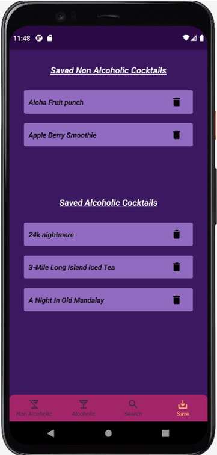
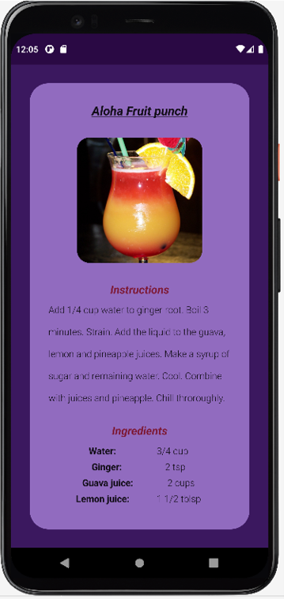

<h1 align="center">Lets's Get Cocky Android App</h1>

<p align="center">
  <a href="https://opensource.org/licenses/Apache-2.0"></a>
</p>

<p align="center">  
Built with Jetpack Compose, Lets's Get Cocky is a small demo application based on modern Android tech-stacks and Clean Architecture. The app fetches data from the network and integrate it with the persisted data in the database via repository pattern.
</p>

 <p align="center">
  
  
  
  
  
  
</p>

## Tech stack
* ✅ Clean Architecture
* ✅ Repository pattern
* ✅ MVVM
* ✅ Jetpack Compose 
* ✅ Dagger - Hilt
* ✅ Livedata
* ✅ Viewmodel
* ✅ Retrofit
* ✅ Flow
* ✅ Kotlin Coroutines
* ✅ Material Components
* ✅ Jetpack Navigation Component Compose
* ✅ Light and Dark theme

## MAD Score


# License
```xml
Designed and developed by 2021 Pulkit

Licensed under the Apache License, Version 2.0 (the "License");
you may not use this file except in compliance with the License.
You may obtain a copy of the License at

   http://www.apache.org/licenses/LICENSE-2.0

Unless required by applicable law or agreed to in writing, software
distributed under the License is distributed on an "AS IS" BASIS,
WITHOUT WARRANTIES OR CONDITIONS OF ANY KIND, either express or implied.
See the License for the specific language governing permissions and
limitations under the License.
```

